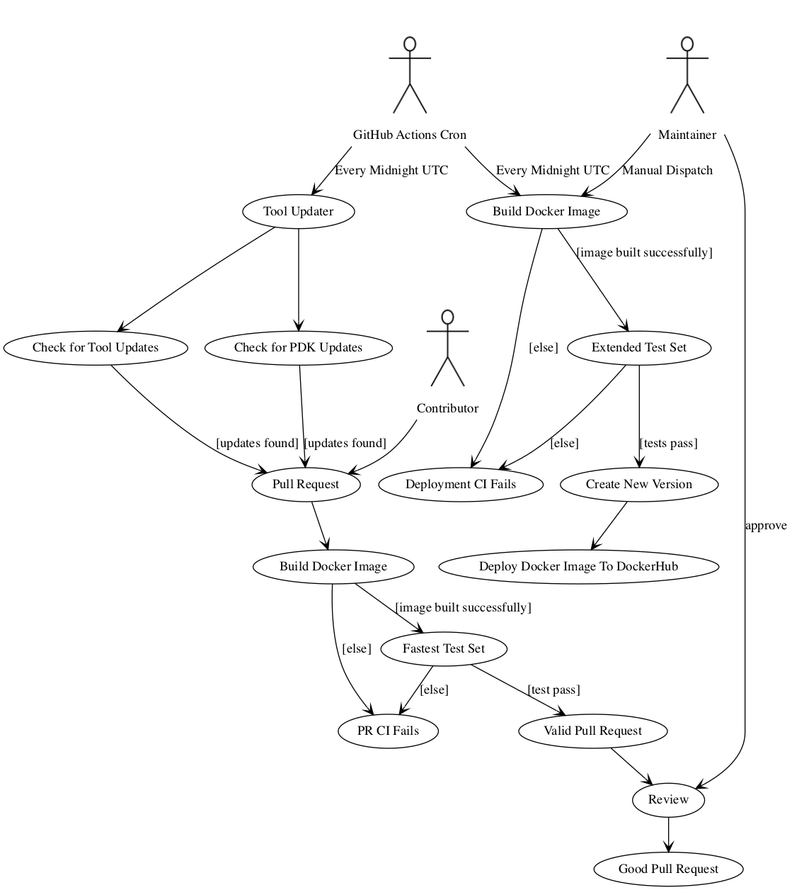

# Openlane CI/CD
There are two primary flows: the pull request flow and the deployment flow.

The deployment flow occurs on a daily basis. The PR flow happens whenever someone creates a new Pull Request. PRs can be created by contributors or by an automated tool updater that runs on a schedule.

The tool updater is maintained in a separate repository: https://github.com/openlane-bot/openlane-tool-updater by the bot that creates the PRs.

* A maintainer cannot review their own code, but they can merge it after a review by another maintainer.

# Required Secrets
Repository secrets are used to protect certain credentials, but also as repository-dependent parameters for the CI.

## OpenLane CI

| Secret      | Description                                                   |
|---------------|---------------------------------------------------------------|
| `DOCKERHUB_USER`  | A username for a user that has push access to the Efabless organization on Docker Hub. |
| `DOCKERHUB_PASSWORD`  | The password for the given username that has push access to the Efabless organization on Docker Hub. |
| `DOCKER_IMAGE` | The name of the resulting Docker image (minus the tag). |

## Tool Updater

| Secret      | Description                                                   |
|---------------|---------------------------------------------------------------|
| `OPENLANE_REPO`  | The URL for the GitHub repo for OpenLane. |
| `OPENLANE_BRANCH`  | The main branch for OpenLane. |
| `MY_TOKEN`  | A user Github with push access to the repository. Despite Github Actions internally providing GITHUB_TOKEN for the action to use. pushing/creating a branch with this token will prevent Github Actions from running on the created branch/pushed commit/submitted PR. This is a policy by Github Actions to prevent circular calls as a general rule while still providing a way for the user to do it if they know what they are doing. |